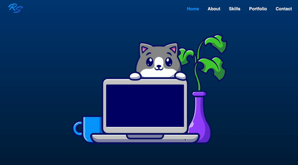

## Personal Portfolio

Hello! Welcome to my website!

This is my personal portfolio where I showcase my skills and projects in computer science and software development. I designed and developed this responsive personal portfolio website using **HTML**, **CSS**, and **JavaScript**. 

### Features

- **Responsive Design**: The website is optimized for various devices, including mobile phones.
- **Interactive Elements**: Enhanced user experience with interactive features and animations.
- **Project Showcase**: Highlights my work, including games and applications I've developed.

### Technologies Used

- HTML5
- CSS3
- JavaScript

## Getting Started

To view my portfolio, simply visit [ruhisawant.github.io](https://ruhisawant.github.io).

### Website Preview

### Contact

Feel free to reach out to me for collaboration or inquiries:

- **Email**: [ruhi.p.sawant@gmail.com](mailto:ruhi.p.sawant@gmail.com)
- **LinkedIn**: [ruhi-sawant](https://www.linkedin.com/in/ruhi-sawant/)

Thank you for visiting my portfolio!
